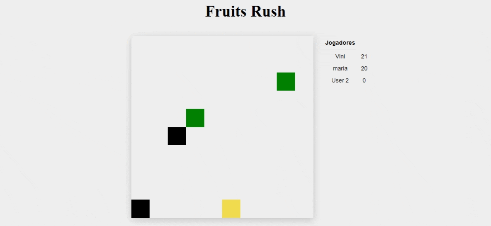

# Meu jogo multiplayer

> :construction: Projeto em construção :construction:

📚 Projeto criado para estudo de: 
- Arquitetura e Desenvolvimento de software;
- Desenvolvimento Web Fullstack;
- Websockets;
- Design patterns como observer e factory.

📹 Este projeto foi desenvolvido com base na playlist de vídeos do [Filipe Dechamps](https://www.youtube.com/playlist?list=PLMdYygf53DP5SVQQrkKCVWDS0TwYLVitL).

-----

As melhorias e personalizações criadas até o momento:

- [x] Inserção de uma tela de login, onde a pessoa pode colocar um nickname personalizado.
- [x] Acréscimo do limite de frutas (pixels verdes) desenhados na tela
- [x] Acréscimo do limite de conexões
- [ ] 
